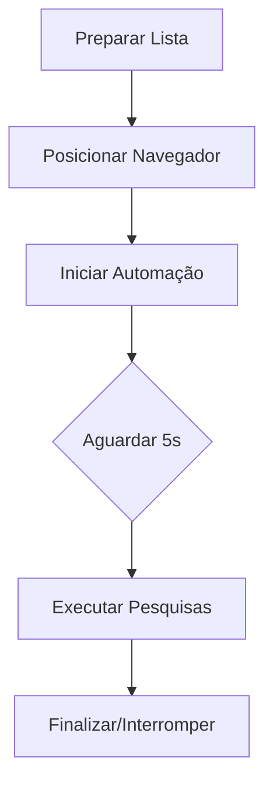

# Auto Pesquisa - Automação de Pesquisas no Navegador

## Descrição
Programa de automação que realiza pesquisas no navegador de forma sequencial, com interface gráfica intuitiva desenvolvida em Python.

## Funcionalidades Principais
- 🖥️ Interface gráfica amigável com Tkinter
- 📝 Lista editável de termos de pesquisa
- ➕/➖ Adicionar e remover pesquisas individualmente
- ⏯️ Controle de execução (iniciar/parar)
- 📊 Barra de status com progresso
- ⌨️ Atalho por tecla (ESC para interromper)

## Pré-requisitos
- Python 3.8+
- Pip para instalação de pacotes

## Personalização
Modifique pesquisas = [...] no código para alterar a lista padrão

Ajuste os tempos de espera nas funções time.sleep()

## Instalação
```bash
git clone git clone https://github.com/tomaziu/auto_pesquisa.git
cd auto_pesquisa
pip install -r requirements.txt
```
# 📝 Descrição Detalhada do Software Auto Pesquisa

## 🖥️ **Visão Geral da Interface**
Aplicação desktop Python para automação de pesquisas no navegador com interface Tkinter intuitiva e responsiva.

## 🎯 **Principais Funcionalidades**

### 🔘 **Sistema de Controle Principal**
| Botão          | Função                          | Comportamento                                                                 |
|----------------|---------------------------------|-------------------------------------------------------------------------------|
| ▶️ Iniciar     | Inicia automação                | Mostra confirmação, executa pesquisas sequenciais com feedback visual        |
| ⏹️ Parar (ESC) | Interrompe execução             | Responde ao botão ou tecla ESC, encerra com segurança                         |
| ➕ Adicionar   | Insere nova pesquisa            | Abre pop-up, valida entrada, adiciona ao final da lista                      |
| ➖ Remover     | Exclui pesquisas selecionadas   | Remove itens selecionados (suporta múltiplas seleções com Ctrl+Clique)       |

## ⚙️ **Mecanismo de Operação**

## 🤝 Como Contribuir

Contribuições são extremamente bem-vindas! Seguimos um fluxo simples:

1. **Faça um Fork**  
   Clique no botão `Fork` no canto superior direito desta página

2. **Crie sua Branch**  
   ```bash
   git checkout -b feature/sua-feature-incrivel

## Licença
Distribuído sob licença MIT. Veja LICENSE para detalhes.
